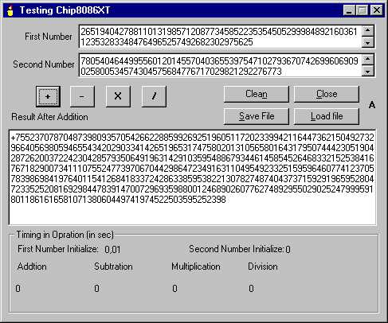



## Chip8086XT

### Description

If you ever think what happened if your number is bigger than your data type provided by any languages (c/c++/Delphi/Java/VB ..) well we can't able to do any mathematical/logical operations (we will get an overflow error msg.!!).

I was working on this topic since a long time and finally I found a logic to overcome this problem(but still a lot has to be done to improve the logic and techniques).

Here you can find an Object, I called is Chip8086XT.

Chip8086XT is nothing but an ActiveX DLL, written in VB6.0.(New version of my 'MathOperator.dll', better in performance.). Right now chip8086XT can able to handle basic mathematical operations (i.e. +, - , * , / ) only, and I have test the object successfully till 200 000 digits. I included a TestChip8086XT program to test Object and also included help for all the properties and methods (for more details please check readme.txt).

Sorry to say but it's true, it may not be very useful in normal programming, but I believe it would be very useful in scientific-research work. This is one step ahead into the feature development/enhancement of computer technology. A lot more work left to implement all other mathematical/logical operations and improve the performance.

Your valuable comments/suggestion would be helpful to improve Chip8086XT. If some body working on this topic please contact me. -Thanks
 
### More Info
 

             |
---                |---
**Submitted On**   |2002-10-08 11:33:50
**By**             |[Deepak Kumar Shaw](https://github.com/Planet-Source-Code/PSCIndex/blob/master/ByAuthor/deepak-kumar-shaw.md)
**Level**          |Advanced
**User Rating**    |3.4 (27 globes from 8 users)
**Compatibility**  |VB 4\.0 \(32\-bit\), VB 5\.0, VB 6\.0, VB Script, ASP \(Active Server Pages\) , VBA MS Access
**Category**       |[VB function enhancement](https://github.com/Planet-Source-Code/PSCIndex/blob/master/ByCategory/vb-function-enhancement__1-25.md)
**World**          |[Visual Basic](https://github.com/Planet-Source-Code/PSCIndex/blob/master/ByWorld/visual-basic.md)
**Archive File**   |[Chip8086XT1425131082002\.zip](https://github.com/Planet-Source-Code/deepak-kumar-shaw-chip8086xt__1-39639/archive/master.zip)

